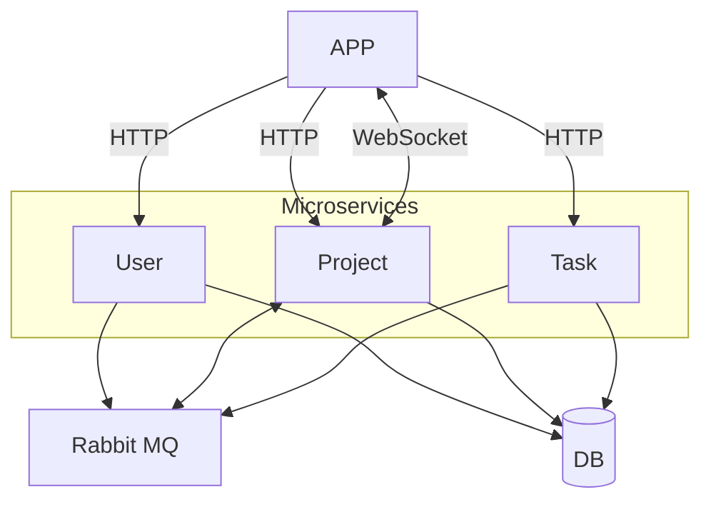

```mermaid

graph TD
    APP[APP]
    User[User]
    Project[Project]
    Task[Task]
    RabbitMQ[Rabbit MQ]
    DB[(DB)]

    APP -->|HTTP| User
    APP -->|HTTP| Project
    APP -->|HTTP| Task
    APP <-->|WebSocket| Project

    User --> RabbitMQ
    Project <--> RabbitMQ
    Task --> RabbitMQ

    User --> DB
    Project --> DB
    Task --> DB

    subgraph Microservices
        User
        Project
        Task
    end
```