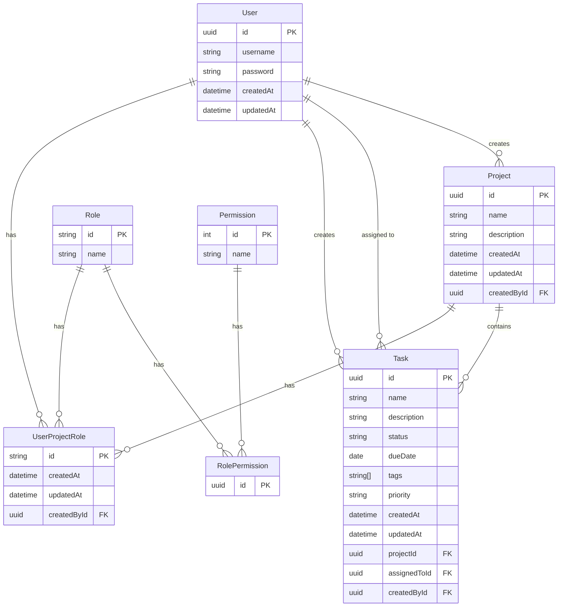

```mermaid
erDiagram
    User ||--o{ UserProjectRole : has
    User ||--o{ Task : creates
    User ||--o{ Task : "assigned to"
    User ||--o{ Project : creates
    Project ||--o{ UserProjectRole : has
    Project ||--o{ Task : contains
    Role ||--o{ UserProjectRole : has
    Role ||--o{ RolePermission : has
    Permission ||--o{ RolePermission : has

    User {
        uuid id PK
        string username
        string password
        datetime createdAt
        datetime updatedAt
    }

    Project {
        uuid id PK
        string name
        string description
        datetime createdAt
        datetime updatedAt
        uuid createdById FK
    }

    Task {
        uuid id PK
        string name
        string description
        string status
        date dueDate
        string[] tags
        string priority
        datetime createdAt
        datetime updatedAt
        uuid projectId FK
        uuid assignedToId FK
        uuid createdById FK
    }

    UserProjectRole {
        string id PK
        datetime createdAt
        datetime updatedAt
        uuid createdById FK
    }

    Role {
        string id PK
        string name
    }

    Permission {
        int id PK
        string name
    }

    RolePermission {
        uuid id PK
    }
```