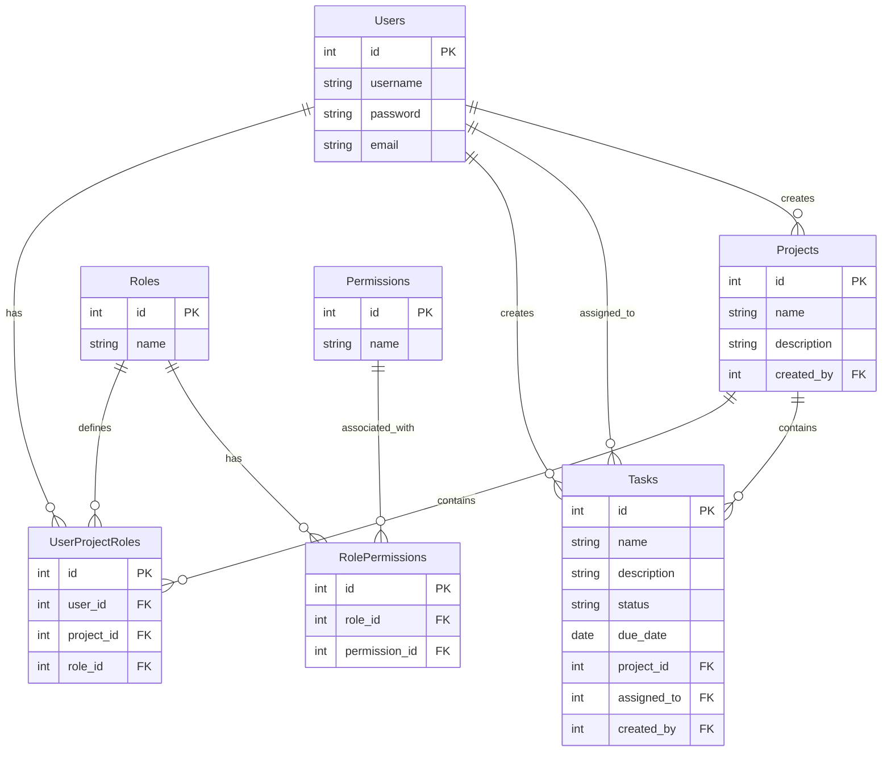

```mermaid

erDiagram
    Users ||--o{ UserProjectRoles : has
    Projects ||--o{ UserProjectRoles : contains
    Roles ||--o{ UserProjectRoles : defines
    Users ||--o{ Tasks : creates
    Users ||--o{ Tasks : assigned_to
    Users ||--o{ Projects : creates
    Roles ||--o{ RolePermissions : has
    Permissions ||--o{ RolePermissions : associated_with
    Projects ||--o{ Tasks : contains

    Users {
        int id PK
        string username
        string password
        string email
    }

    Projects {
        int id PK
        string name
        string description
        int created_by FK
    }

    Roles {
        int id PK
        string name
    }

    UserProjectRoles {
        int id PK
        int user_id FK
        int project_id FK
        int role_id FK
    }

    Permissions {
        int id PK
        string name
    }

    RolePermissions {
        int id PK
        int role_id FK
        int permission_id FK
    }

    Tasks {
        int id PK
        string name
        string description
        string status
        date due_date
        int project_id FK
        int assigned_to FK
        int created_by FK
    }


```
